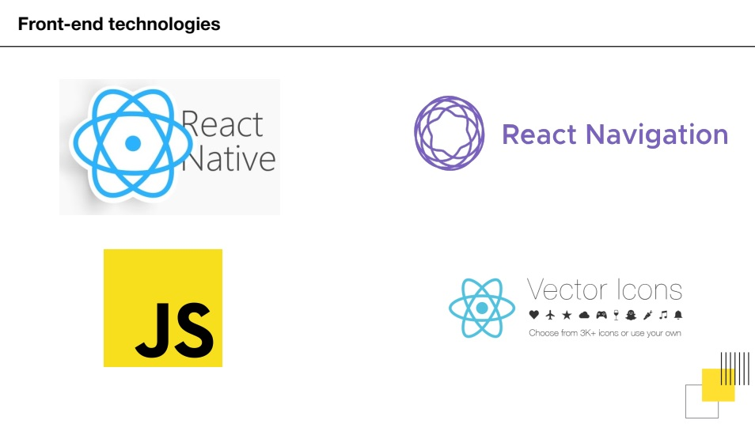
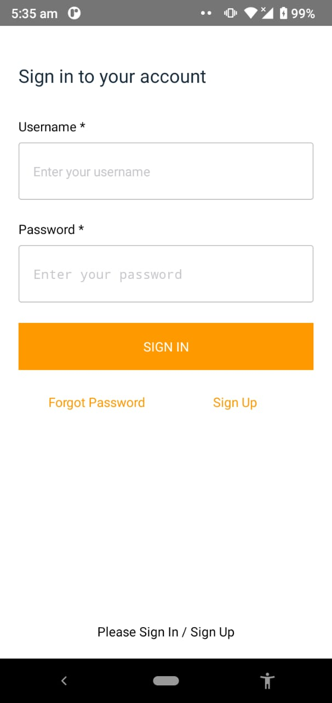
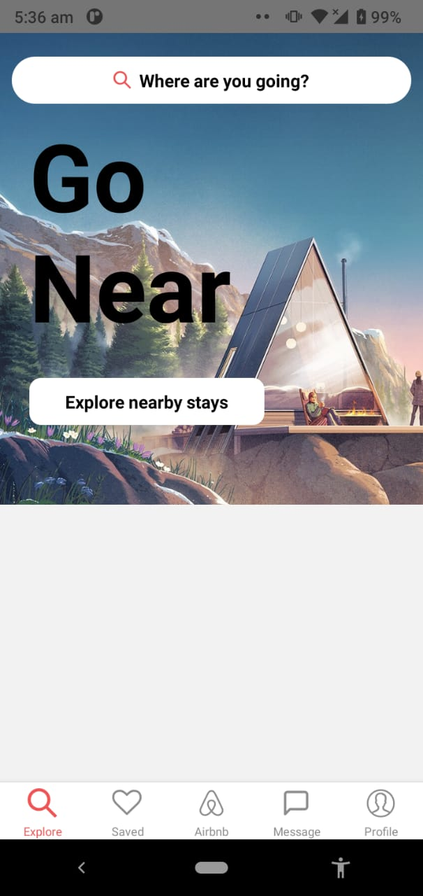
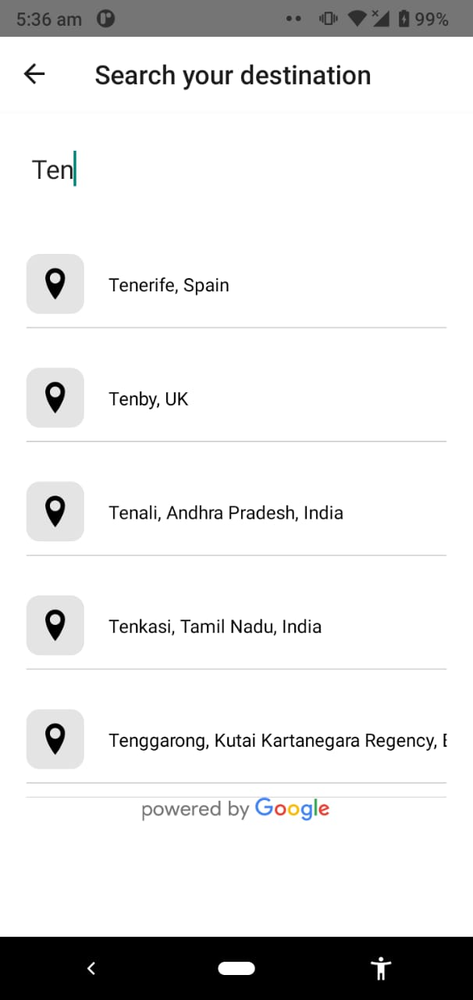
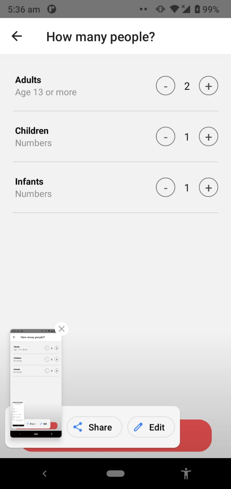
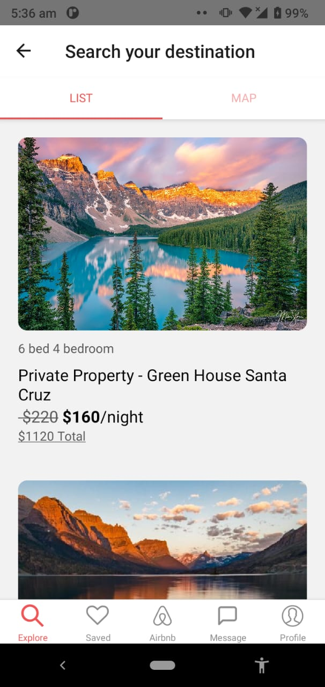
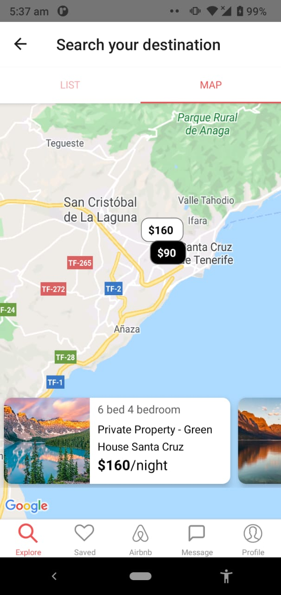
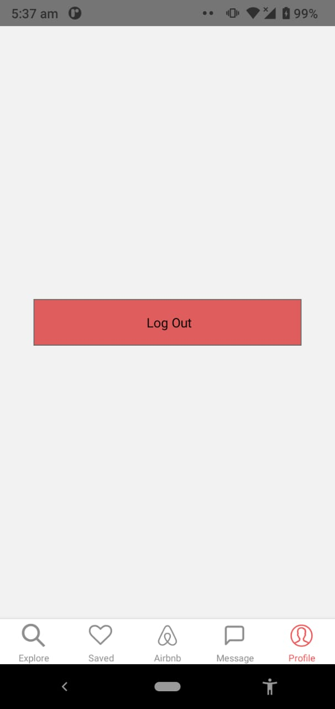

This AirBnB clone is made with react native. I have used aws-amplify and DynamoDB for the backend. It also has google maps and aws-Authentication in this project.
Technologies Used:  

Screen Overreview:  

